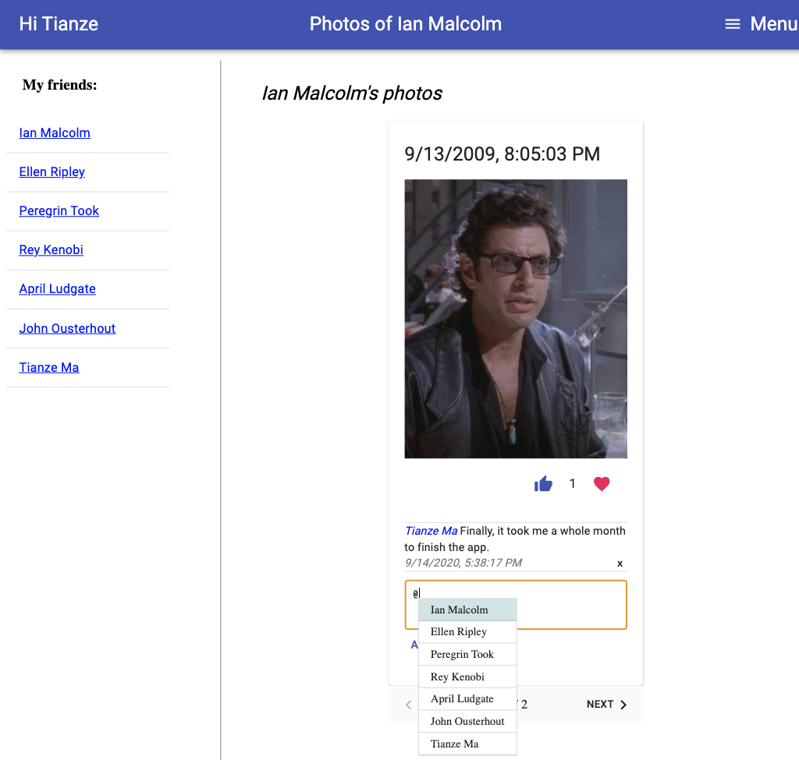

# photo-share-app
This is a MERN stack web app that support all basic functionalities for users to log in and out, register, check out their friends’ photos, like and comment, upload photos with visibility control and follow up on their friends’ recent activities

The app is deployed on Heroku : https://photo-sharing-application.herokuapp.com/

Login and Register

View Friend's Information

Add Comment and Mention Others

Add New Photo and Specify Scope

See All Favorite Photos

